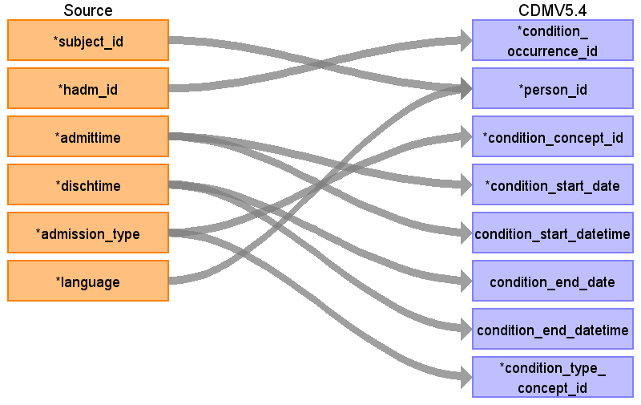
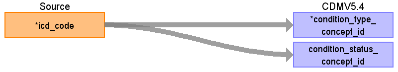

## Table name: condition_occurrence

### Reading from admissions

| Destination Field | Source field | Logic | Comment field |
| --- | --- | --- | --- |
| condition_occurrence_id | hadm_id | Use as is. Unique value. |  |
| person_id | subject_id language | use as is.   The subject_id must be unique. Use concept_id 4180186 for English language. |  |
| condition_concept_id | admission_type | Use as is. |  |
| condition_start_date | admittime | Use only the date part. |  |
| condition_start_datetime | admittime | Use the timestamp. |  |
| condition_end_date | dischtime | Use only the date part. |  |
| condition_end_datetime | dischtime | Use the timestamp. |  |
| condition_type_concept_id | admission_type | Use as is. |  |
| condition_status_concept_id |  |  |  |
| stop_reason |  |  |  |
| provider_id |  |  |  |
| visit_occurrence_id |  |  |  |
| visit_detail_id |  |  |  |
| condition_source_value |  |  |  |
| condition_source_concept_id |  |  |  |
| condition_status_source_value |  |  |  |

### Reading from d_icd_diagnoses

| Destination Field | Source field | Logic | Comment field |
| --- | --- | --- | --- |
| condition_occurrence_id |  |  |  |
| person_id |  |  |  |
| condition_concept_id |  |  |  |
| condition_start_date |  |  |  |
| condition_start_datetime |  |  |  |
| condition_end_date |  |  |  |
| condition_end_datetime |  |  |  |
| condition_type_concept_id | icd_code | Mapping the ICD code with the OMOP standards like :  > Case Report Form - OMP4976882 |  |
| condition_status_concept_id | icd_code | Mapping the ICD code with the OMOP standards like :  > Admission diagnosis - OMOP4976960 |  |
| stop_reason |  |  |  |
| provider_id |  |  |  |
| visit_occurrence_id |  |  |  |
| visit_detail_id |  |  |  |
| condition_source_value |  |  |  |
| condition_source_concept_id |  |  |  |
| condition_status_source_value |  |  |  |

