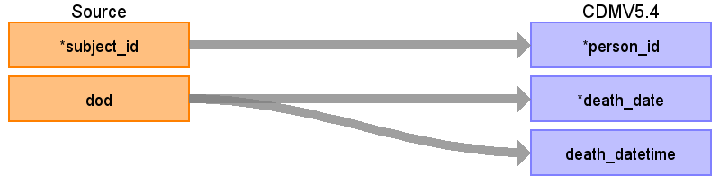
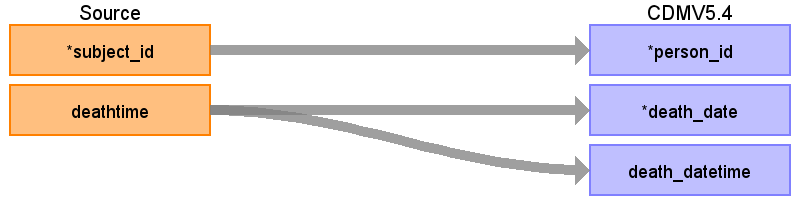

## Table name: death

### Reading from patients

| Destination Field | Source field | Logic | Comment field |
| --- | --- | --- | --- |
| person_id | subject_id | Use as it is. It must be unique.  Create a unique id for each patient based on their subject_id |  |
| death_date | dod | Use as is.  Optional if not available. |  |
| death_datetime | dod | Use as is.  Optional if not available. |  |
| death_type_concept_id |  |  |  |
| cause_concept_id |  |  |  |
| cause_source_value |  |  |  |
| cause_source_concept_id |  |  |  |

### Reading from admissions

| Destination Field | Source field | Logic | Comment field |
| --- | --- | --- | --- |
| person_id | subject_id | Use as it is. It must be unique.  Create a unique id for each patient based on their subject_id |  |
| death_date | deathtime | use date part only. |  |
| death_datetime | deathtime | Use full timestamp if available. |  |
| death_type_concept_id |  |  |  |
| cause_concept_id |  |  |  |
| cause_source_value |  |  |  |
| cause_source_concept_id |  |  |  |

