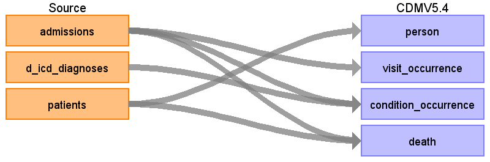

# Source Data Mapping Approach to CDMV5.4

## Contents

[person](person.md)

[visit_occurrence](visit_occurrence.md)

[condition_occurrence](condition_occurrence.md)

[death](death.md)

[source_appendix](source_appendix.md)

