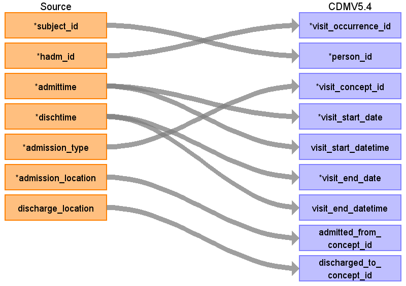

## Table name: visit_occurrence

### Reading from admissions

| Destination Field | Source field | Logic | Comment field |
| --- | --- | --- | --- |
| visit_occurrence_id | hadm_id | Unique ID per admission |  |
| person_id | subject_id | Use as it is. It must be unique.  Create a unique id for each patient based on their subject_id |  |
| visit_concept_id | admission_type | Map visit to OMOP standard concepts as follows :  > Inpatient Visit - 9201  > Outpatient Visit - 9202  > Emergency Room Visit - 9203 |  |
| visit_start_date | admittime | Use only the date field. |  |
| visit_start_datetime | admittime | Use the timestamp if available. |  |
| visit_end_date | dischtime | Use only the date. |  |
| visit_end_datetime | dischtime | Use timestamp if available. |  |
| visit_type_concept_id |  |  |  |
| provider_id |  |  |  |
| care_site_id |  |  |  |
| visit_source_value |  |  |  |
| visit_source_concept_id |  |  |  |
| admitted_from_concept_id | admission_location | Map to the following code for :  > Emergency - 8870 |  |
| admitted_from_source_value |  |  |  |
| discharged_to_concept_id | discharge_location | Use as is, 0 for discharge to home. |  |
| discharged_to_source_value |  |  |  |
| preceding_visit_occurrence_id |  |  |  |

